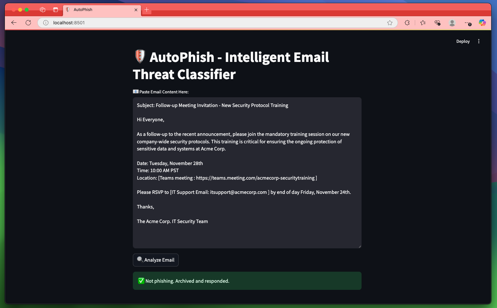
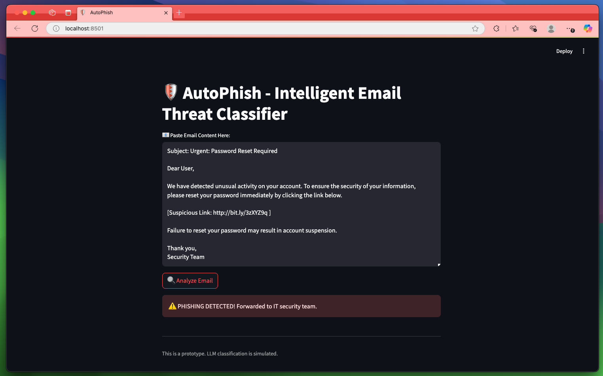

# 🛡️ AutoPhish — Intelligent Email Threat Classifier 
AutoPhish is an AI-powered email classification prototype that detects phishing attempts using an LLM backend. It's designed to be seamlessly integrated into enterprise email systems and security workflows.

## 📷 Demo





## 🚀 Features

- 📧 **Paste Email Content**: Simulate an incoming email.
- 🤖 **LLM-based Detection**: Uses a large language model to classify emails as "Phishing" or "Not Phishing".
- ⚡ **Instant Action**: 
  - ✅ If *not phishing*: Archive + auto-response simulated.
  - ⚠️ If *phishing*: Simulated report to IT Security.

## 🧠 How It Works

- Built with **Streamlit** for rapid prototyping.
- Email content is passed to an **LLM** running on an **OpenAI Comptible Endpoint**
- The model returns a one-word decision: `"Phishing"` or `"Not Phishing"`.

## 🔧 Tech Stack

- [Streamlit](https://streamlit.io/)
- [Ollama](https://ollama.com/) or [LM Studio](https://lmstudio.ai/)
- Python, requests

## 📦 Local Setup

```bash
git clone https://github.com/yourusername/autophish.git
cd autophish
streamlit run app.py
```

## 🧭 Future Vision

- 🧩 Outlook Plugin: Direct integration with enterprise Outlook environments

- 🛠️ Tool-Calling LLM: To trigger actions like auto-reply, quarantine, IT report

- 🧠 MCP server integration: The LLM can directly have access to the emails and tools for further actions

- 🗂️ Archival & Search: Automatic archiving and tagging of safe conversations

- 🌃 Multimodal support : Enhancing understanding by accepting image/attachment inputs too

- 🌐 SOC Integration: Plug into existing security orchestration systems (SOAR)
